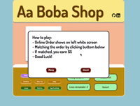

# BACKGROUND

"Aa Boba" is a single-player game, which player becomes a boba shop barista called Aa Boba, players need to make boba drink from customers who ordered online.  Player has three mess up chance before the shop closed.

## [Live Here!](https://kayileung.github.io/Aa_Boba/)

## Wireframes

## Technologies, APIs
- Canvas API is used for drawing boba cup
- Javascripts/HTML/CSS
- Vanilla DOM Manipulation
- Webpack
- Github

## Implementation Timeline
- Friday and Weekedn - do research of canvas, working on game logic 
- Monday: finished basic game logic, tested with console.log, started working with canvas
- Tuesday: implement canvas and HTML
- Wednesday: working on start, music buttons
- Thurday morning: deploy project

## Future Goals
- create new canvas for toppings
- create animation controlling(e.g hands working while making boba)
- add walkin customers to increase game level

## Music Credit:
### Monkeys Spinning Monkeys Kevin MacLeod (incompetech.com)
Licensed under Creative Commons: By Attribution 3.0 License
http://creativecommons.org/licenses/by/3.0/
Music promoted by https://www.chosic.com/free-music/all/

